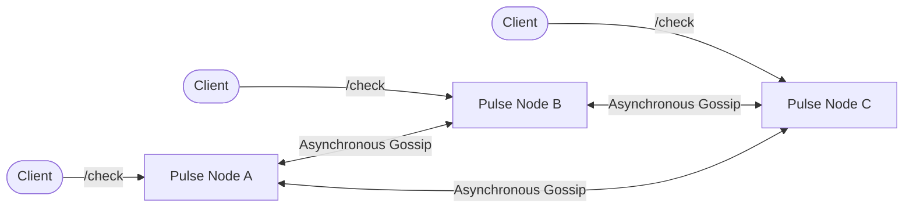

# Pulse 🚀

[](https://openjdk.java.net/)
[](https://www.docker.com/)
[](https://opensource.org/licenses/MIT)

Pulse is a **coordinator-free distributed rate limiter** built with dependency-free Java. 

Every `/check` decision uses local memory only, providing sub-millisecond latencies. Nodes exchange bucketed G-Counter state in the background and merge each cell with `max`, so duplicate, late, and reordered gossip cannot corrupt the count.

The deliberate trade-off is temporary over-admission: nodes can admit more than the configured cluster-wide limit before gossip converges. Pulse is a compact system for measuring that availability/precision trade-off, not a strict global quota service.

---

## 🏗️ Architecture



## ✨ Features

- Thread-safe bucketed G-Counter CRDT.
- Local-only request path for ultra-fast checks.
- Best-effort full-state peer gossip with HMAC signatures.
- Bounded gossip bodies and key cardinality (LRU Eviction).
- Health, read-only estimate, and Prometheus metrics endpoints.
- Deterministic unit and HTTP integration tests.
- Real three-process convergence and partition smoke test.
- Three-node Docker Compose cluster.
- Dependency-free Python benchmark tool.
- Architecture, API contract, decisions, task memory, and self-review docs.

## 📋 Requirements

- **JDK 17 or newer** for local builds.
- **Docker with Compose** for the container cluster.
- **Python 3.10 or newer** for benchmark and smoke scripts.
- **Strict NTP synchronization** across all nodes to prevent time drift and maintain CRDT convergence.

*Note: The service itself has no third-party dependencies.*

## 🚀 Getting Started

### Compile and Test Locally

```bash
mkdir -p out
javac -encoding UTF-8 -d out *.java
java -ea -cp out PulseTests
```

On PowerShell:

```powershell
.\run-tests.ps1
```

Run the full local three-node smoke test:

```bash
python scripts/smoke_cluster.py
```
*(It compiles the project, starts three Java processes, verifies convergence, terminates node B, and confirms nodes A and C still serve.)*

### Run a Single Node

**PowerShell:**
```powershell
$env:NODE_ID = "node-a"
$env:PORT = "9001"
$env:PEERS = "localhost:9002,localhost:9003"
$env:LIMIT = "50"
$env:WINDOW_BUCKETS = "10"
$env:BUCKET_MS = "1000"
$env:GOSSIP_INTERVAL_MS = "200"
$env:CLUSTER_SECRET = "0123456789abcdef0123456789abcdef"
java -cp out PulseNode
```

**Bash:**
```bash
NODE_ID=node-a PORT=9001 \
PEERS=localhost:9002,localhost:9003 \
LIMIT=50 WINDOW_BUCKETS=10 BUCKET_MS=1000 GOSSIP_INTERVAL_MS=200 \
CLUSTER_SECRET=0123456789abcdef0123456789abcdef \
java -cp out PulseNode
```
*Start two more terminals with unique `NODE_ID`/`PORT` values and peer lists.*

### Run the Docker Cluster

```bash
docker compose up --build
```

The host endpoints are:
- node A: `http://localhost:8081`
- node B: `http://localhost:8082`
- node C: `http://localhost:8083`

**Test it out:**
```bash
curl "http://localhost:8081/check?key=ip:1.2.3.4"
curl "http://localhost:8082/estimate?key=ip:1.2.3.4"
curl "http://localhost:8083/health"
curl "http://localhost:8081/metrics"
```

Stop one peer without stopping the cluster:
```bash
docker stop pulse-node-b
curl "http://localhost:8081/check?key=still-serving"
curl "http://localhost:8083/check?key=still-serving"
```

## 📖 API Reference

| Method and path | Purpose |
|---|---|
| `GET /check?key=X` | Increment and make a local admission decision |
| `GET /estimate?key=X` | Read the local estimate without incrementing |
| `POST /gossip` | Merge a peer's versioned CRDT snapshot |
| `GET /health` | Report local serving health and state size |
| `GET /metrics` | Return Prometheus text metrics |

`/check` returns `allowed: true` when the post-increment local estimate is at most `LIMIT`. Denied attempts remain counted until their buckets expire.

Full contracts and status codes are in [spec.md](docs/spec.md).

## 📊 Benchmarks

With the Docker cluster running:

```bash
python scripts/benchmark.py convergence --requests 60 --limit 50
python scripts/benchmark.py load --requests 10000 --concurrency 100
python scripts/benchmark.py bandwidth --keys 1000 --settle-seconds 2
```

Use a custom cluster:

```bash
python scripts/benchmark.py \
  --nodes http://host-a:9001,http://host-b:9001 \
  convergence --requests 1000 --limit 500
```

See [BENCHMARKING.md](BENCHMARKING.md) for the experiment matrix and how to interpret the results.

## 🗺️ Repository Map

- [spec.md](spec.md): requirements and API contract.
- [architecture.md](architecture.md): components, state, concurrency, failures.
- [design.md](design.md): decision records and trade-offs.
- [flow-review.md](flow-review.md): end-to-end data flow and self-review.
- [context.md](context.md): compact handoff memory for a future session.
- [tasks/phase1.md](tasks/phase1.md): completed build checklist.
- [docs/audit_report.md](docs/audit_report.md): initial security audit and code review report.
- [docs/indepth_audit.md](docs/indepth_audit.md): comprehensive audit covering architecture, performance, and operational readiness.

## ⚠️ Production Caveats

Pulse assumes trusted peers and reasonably synchronized clocks. It is in-memory, uses static membership, and intentionally provides no strict global limit. A production deployment needs authenticated gossip (HMAC is supported), a node incarnation strategy on restart, load measurements, and likely state sharding or delta gossip.
